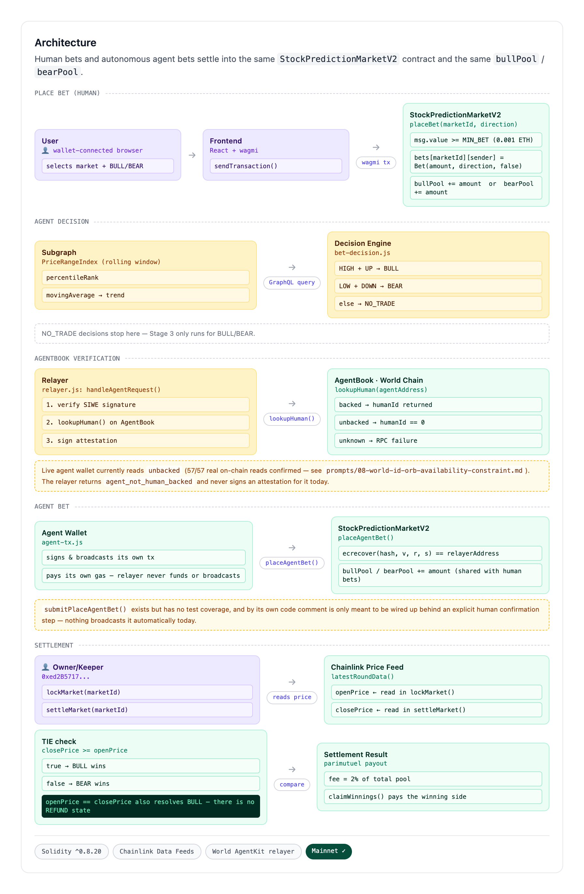

# Robinhood Stock Prediction Market


A parimutuel stock prediction market built on Robinhood Chain Mainnet, using native Stock Tokens (TSLA, AMZN, PLTR, AMD, NVDA) and live Chainlink Data Feeds as the price oracle.

**[Live Demo](https://frontend-tau-azure-50.vercel.app)** · Network: Robinhood Chain Mainnet (Chain ID 4663)

## What's New vs. Existing

### Existing (pre-hackathon)

- **Parimutuel prediction market contract** — live on Robinhood Chain Mainnet
  (Chain ID 4663) since July 3, 2026 (`b7b2071`, `d45fb8e`). Real on-chain
  history to date: 29 `createMarket`, 27 `lockMarket`, 27 `settleMarket`,
  3 `placeBet`, 1 `claimWinnings` (independently counted, `da13c80`).
- **React + wagmi frontend**, deployed to Vercel (`f40f9a1`, `0e2688d`,
  through subsequent fixes to `17c4ba9`).
- **VPS-based keeper** for `lockMarket`/`settleMarket` operation (`664d535`,
  `b4748f6`, and other `maint:` commits).
- **Independent settlement verification layer** (`da13c80`, added
  September 3, 2026 ahead of Continuity Track submission): a Python
  reference model derived from the contract's external spec/ABI, cross-checked
  against all 27 real `settleMarket` transactions and the 1 real
  `claimWinnings` transaction pulled directly from chain. 28/28 match; trace
  sealed via SHA-256 (`verification/settlement/commitments.sha256`).
  Findings: no decimals-normalization in the price-read path (dormant to
  date); README's claimed no-winner refund path has no implementation
  (never triggered); all real settlements to date resolved via
  tie-defaults-to-BULL rather than genuine price movement. Full detail in
  `verification/settlement/comparison_report.md`.

### New (this hackathon — Continuity Track)

- [x] World AgentKit integration — trusted-signer relayer (`relayer/`), gates fund-committing
  agent actions on AgentBook human-verification. `StockPredictionMarketV2.placeAgentBet()`
  validates and consumes the attestation on-chain; broadcasting that transaction is still a
  manually-triggered step, and the live agent wallet currently reads `unbacked` on AgentBook.
  See [Honest Disclosure](#honest-disclosure-agentkit-relayer) below.
- [x] Graph computation layer — `subgraph/`, `PriceRangeIndex` rolling-window stats, verified
  against a Python reference model on 89 real on-chain events (`verification/graph-computation/`).
- [x] Decision engine reference model — `decision-engine/`, BULL/BEAR/NO_TRADE over
  `PriceRangeIndex` + relayer attestation status, verified against a Python reference model on
  the same 89 real snapshots (`verification/decision/`). See
  [Honest Disclosure](#honest-disclosure-agentkit-relayer) and `docs/spec.md` for the momentum
  vs. mean-reversion signal-direction choice.
- [x] Agent Decision Transparency page — `/agent-activity` (`AgentDecisionPanel` component,
  backed by `frontend/api/agent-status.js`), a read-only visualization of the live agent decision
  pipeline. Reuses `decision-engine/` and `relayer/` modules directly rather than reimplementing
  any logic; never calls `placeBet()` or `placeAgentBet()`. This is currently the only place a
  user can actually observe the pipeline described in
  [Honest Disclosure](#honest-disclosure-agentkit-relayer) below, rather than just read about it.

## Core Features

**Chain-Native Stock Token Integration**
Each market is anchored to a Robinhood Chain native stock token address. `createMarket()` accepts `address stockToken` directly, creating an on-chain verifiable link between the prediction market and the actual tokenized equity — something only possible on a chain purpose-built for RWA.

**Live Chainlink Data Feeds**
The contract reads real-time stock prices via Chainlink `AggregatorV3Interface`. Each stock has a dedicated `ChainlinkPriceFeed` wrapper deployed on Robinhood Chain Mainnet, connected to Chainlink's official price feed proxies live from day one of mainnet launch.

**Parimutuel Settlement**
No order book, no counterparty risk. BULL and BEAR pools accumulate independently. At settlement, the winning side splits the total pool proportional to their stake, minus a 2% protocol fee.

**Full Market Lifecycle**
`OPEN → LOCKED → SETTLED`. `lockMarket()` snapshots the opening price from the oracle. `settleMarket()` reads the closing price and determines the winning direction.

## Architecture



*Source: `docs/architecture-source.html` (rendered via Puppeteer — see the comment at the top of
that file before editing either one).*

> *Known limitation, verified against `contracts/StockPredictionMarketV2.sol`: `openPrice` is
> snapshotted inside `lockMarket()` at execution time (not saved earlier in `createMarket()`), so
> a Chainlink round that hasn't updated yet between `lockMarket()` and `settleMarket()` can produce
> `openPrice == closePrice`. `settleMarket()` and `claimWinnings()` both resolve ties with
> `price >= openPrice`, so BULL wins by default — there is no `REFUND` market state. This is
> intentional, tested behavior (`test_12_tieSettlement_fullClaimFlow`,
> `test_19_tieDirectionOnly_noBets_matchesTC09` in `test/StockPredictionMarketV2.t.sol`), carried
> over unchanged from the original contract, not a pending fix.

## Deployed Contracts

### Robinhood Chain Mainnet (Chain ID: 4663)

| Contract | Address |
|----------|---------|
| StockPredictionMarketV2 | [0x59DF30E22bdaC70764a5DbF8bBa51BC5a595759C](https://robinhoodchain.blockscout.com/address/0x59DF30E22bdaC70764a5DbF8bBa51BC5a595759C) |
| StockPredictionMarket | [0x72DAb8B1B53b3CF028e9A0d1E21178981f264245](https://robinhoodchain.blockscout.com/address/0x72DAb8B1B53b3CF028e9A0d1E21178981f264245) — deprecated, no longer referenced by frontend or any new code |
| AgentStockMarket | [0xE8b3916Ea16AD2F2C0910bB94005e30F5CC341D3](https://robinhoodchain.blockscout.com/address/0xE8b3916Ea16AD2F2C0910bB94005e30F5CC341D3) — deployed 2026-09-05, superseded one day later when ADR-10 merged its attestation-verification logic into `StockPredictionMarketV2.placeAgentBet()`; no longer referenced by any frontend, decision-engine, or relayer code |
| TSLA ChainlinkPriceFeed | [0x072A3A0C04Cf8CDcaf5B4A73a4Ed4fF5A841531f](https://robinhoodchain.blockscout.com/address/0x072A3A0C04Cf8CDcaf5B4A73a4Ed4fF5A841531f) |
| AMZN ChainlinkPriceFeed | [0xcAC5B9d2817325E78090E3Ce4b9C299C819cF953](https://robinhoodchain.blockscout.com/address/0xcAC5B9d2817325E78090E3Ce4b9C299C819cF953) |
| PLTR ChainlinkPriceFeed | [0xBdC53E50b1167cE1199bFaD54A034f7ab1741051](https://robinhoodchain.blockscout.com/address/0xBdC53E50b1167cE1199bFaD54A034f7ab1741051) |
| AMD ChainlinkPriceFeed | [0x15636CE4C0EdE55335f84E6386f8F49C897c077d](https://robinhoodchain.blockscout.com/address/0x15636CE4C0EdE55335f84E6386f8F49C897c077d) |
| NVDA ChainlinkPriceFeed | [0x914c40a644493b47336de847b0404E729e06C68d](https://robinhoodchain.blockscout.com/address/0x914c40a644493b47336de847b0404E729e06C68d) |

### Chainlink Price Feed Proxies (Official, Robinhood Chain Mainnet)

| Ticker | Feed Address |
|--------|-------------|
| TSLA/USD | [0x4A1166a659A55625345e9515b32adECea5547C38](https://robinhoodchain.blockscout.com/address/0x4A1166a659A55625345e9515b32adECea5547C38) |
| AMZN/USD | [0xD5a1508ceD74c084eBf3cBe853e2C968fB2a651C](https://robinhoodchain.blockscout.com/address/0xD5a1508ceD74c084eBf3cBe853e2C968fB2a651C) |
| PLTR/USD | [0x820ABedFF239034956B7A9d2F0a331f9F075eB4c](https://robinhoodchain.blockscout.com/address/0x820ABedFF239034956B7A9d2F0a331f9F075eB4c) |
| AMD/USD | [0x943A29E7ae51A4798823ca9eEd2ed533B2A22C72](https://robinhoodchain.blockscout.com/address/0x943A29E7ae51A4798823ca9eEd2ed533B2A22C72) |
| NVDA/USD | [0x379EC4f7C378F34a1B47E4F3cbeBCbAC3E8E9F15](https://robinhoodchain.blockscout.com/address/0x379EC4f7C378F34a1B47E4F3cbeBCbAC3E8E9F15) |

### Robinhood Chain Stock Tokens (Official)

| Token | Address |
|-------|---------|
| TSLA | [0x322F0929c4625eD5bAd873c95208D54E1c003b2d](https://robinhoodchain.blockscout.com/address/0x322F0929c4625eD5bAd873c95208D54E1c003b2d) |
| AMZN | [0x12f190a9F9d7D37a250758b26824B97CE941bF54](https://robinhoodchain.blockscout.com/address/0x12f190a9F9d7D37a250758b26824B97CE941bF54) |
| PLTR | [0x894E1EC2D74FFE5AEF8Dc8A9e84686acCB964F2A](https://robinhoodchain.blockscout.com/address/0x894E1EC2D74FFE5AEF8Dc8A9e84686acCB964F2A) |
| AMD | [0x86923f96303D656E4aa86D9d42D1e57ad2023fdC](https://robinhoodchain.blockscout.com/address/0x86923f96303D656E4aa86D9d42D1e57ad2023fdC) |
| NVDA | [0xd0601CE157Db5bdC3162BbaC2a2C8aF5320D9EEC](https://robinhoodchain.blockscout.com/address/0xd0601CE157Db5bdC3162BbaC2a2C8aF5320D9EEC) |

### Robinhood Chain Testnet (Chain ID: 46630) — Legacy

| Contract | Address |
|----------|---------|
| StockPredictionMarket | [0x15636CE4C0EdE55335f84E6386f8F49C897c077d](https://explorer.testnet.chain.robinhood.com/address/0x15636CE4C0EdE55335f84E6386f8F49C897c077d) |

## Quick Start

### Prerequisites
- Node.js 18+
- A funded wallet on Robinhood Chain Mainnet

```bash
# 1. Install dependencies
npm install

# 2. Configure environment
cp .env.example .env
```

| Variable | Description |
|----------|-------------|
| `PRIVATE_KEY` | Deployer wallet private key (no 0x prefix) |

```bash
# 3. Compile
npx hardhat compile

# 4. Deploy to mainnet
npx hardhat run scripts/deploy.js --network robinhoodMainnet
```

## Contract Interface

```solidity
// Create a new prediction round
createMarket(address stockToken, address priceFeed, string symbol, uint256 duration) returns (uint256 marketId)

// Place a bet (send ETH as value)
placeBet(uint256 marketId, Direction direction)  // Direction: 0 = BULL, 1 = BEAR

// Lock market and snapshot opening price
lockMarket(uint256 marketId)

// Settle market and determine winner
settleMarket(uint256 marketId)

// Claim winnings after settlement
claimWinnings(uint256 marketId)
```

## Fees & Security

**Fees**
- Protocol fee: 2% of total pool at settlement
- No winner scenario: all bets refunded in full

**Security**
- One bet per address per market
- Minimum bet enforced (0.001 ETH)
- Owner-only market lifecycle controls (createMarket, lockMarket, settleMarket)
- No reentrancy risk: claimed flag set before transfer
- Chainlink staleness check: 3-day threshold (covers weekends and market holidays)

## Implementation Notes

**Live Chainlink Integration**
Robinhood Chain launched mainnet on July 1, 2026 with Chainlink as the official oracle layer from block zero. This contract integrates Chainlink Data Feeds via a `ChainlinkPriceFeed` wrapper that implements `IPriceFeed` (mirrors `AggregatorV3Interface`). Replacing or upgrading feeds requires only a constructor argument change — zero contract modifications.

**Stock Token as Market Identifier**
On most chains, a prediction market would use an arbitrary string or uint to identify a market. On Robinhood Chain, we use the native stock token contract address directly, creating an on-chain verifiable link between the prediction market and the actual tokenized equity.

## Honest Disclosure: AgentKit Relayer

The `relayer/` service is a **trusted-signer relayer bridge, not a trust-minimized one.** It
verifies a World AgentKit-signed agent request, checks the agent's wallet against World Chain's
`AgentBook` for a registered `humanId`, enforces its own replay-nonce, and signs an attestation
with a relayer-held private key. `StockPredictionMarketV2.placeAgentBet()`
(`contracts/StockPredictionMarketV2.sol`) does verify and consume that attestation on-chain: it
`ecrecover`s the signature against `relayerAddress`, checks `expiresAt` and `usedAttestations`,
and credits the bet into the same `bullPool`/`bearPool` a human's `placeBet()` uses.
`decision-engine/src/agent-tx.js` builds, simulates, and can broadcast that transaction from the
agent's own wallet — the agent pays its own gas, the relayer never funds or broadcasts anything
— but its own code comment is explicit that the broadcast step is never invoked automatically
and is meant to be wired up only behind an explicit human confirmation. Nothing in this pipeline
runs unattended end-to-end today.

Separately: the agent wallet this project actually uses currently reads `unbacked` on AgentBook
(57/57 live reads against real, freshly generated addresses returned `unbacked` — see
`prompts/08-world-id-orb-availability-constraint.md`), because obtaining a real Orb-verified
World ID is blocked by an external constraint: Taiwan has no stably operating Orb location, and
a possible World ID Sandbox workaround was never confirmed compatible with AgentBook's on-chain
`groupId=1` check. Concretely, this means the relayer currently refuses to sign an attestation
for this agent at all (`agent_not_human_backed`), so `placeAgentBet()` can never be reached with
a validly-signed attestation through the real pipeline as it stands — the `backed` branch's
correctness has been verified by code review and unit tests only (`relayer/src/agent-book.js`,
exercised in `relayer/test/replay.test.js` and `decision-engine/test/`), not by a live on-chain
bet.

Separately, and identified after the fact during design: World ID (and therefore AgentBook)
proves an agent maps to one distinct real human — *uniqueness* — not that the human authorized
this specific spend or amount, and not a post-hoc auditable record of that authorization. The
current design only blocks agent bets with no real human behind them at all; it does not yet
cover spend limits, scoped authorization, or accountability after the fact. See
`prompts/03-calibrated-autonomy-boundary.md` for the full reasoning.

The `lookupHuman` three-state read (`backed` / `unbacked` / `unknown`, so an AgentBook RPC
failure is never reported as "not registered") follows the pattern documented in
[poh-aggregator](https://github.com/andrevalenm/poh-aggregator)'s
[`lookupHumanBacking`](https://github.com/andrevalenm/poh-aggregator/blob/a26488ac8e3a4ed02068d3693856358b81e7e2fd/apps/agent/src/world/agentbook.js#L63-L82) —
credited here as prior art this implementation deliberately follows, not independently arrived at.

## Stack

| Layer | Technology |
|-------|-----------|
| Smart contract | Solidity ^0.8.20 |
| Development | Hardhat 3 + ethers.js |
| Oracle | Chainlink Data Feeds (AggregatorV3Interface) |
| Stock tokens | Robinhood Chain native (TSLA, AMZN, PLTR, AMD, NVDA) |
| Frontend | React + wagmi v2 + Vite |
| Deployment | Vercel |

## Roadmap

✅ **M1 — Contract Deployment**
- StockPredictionMarket deployed on Robinhood Chain Testnet
- Parimutuel logic with BULL/BEAR markets
- MockPriceFeed (Chainlink-compatible) per stock token

✅ **M2 — Frontend**
- React + wagmi frontend
- Live market odds display, bet placement, claim UI
- Deployed to Vercel

✅ **M3 — Mainnet**
- Deployed to Robinhood Chain Mainnet (Chain ID 4663) on July 3, 2026
- Replaced MockPriceFeed with live Chainlink Data Feeds
- TSLA / AMZN / PLTR / AMD / NVDA markets live

⬜ **W3 — Keeper Automation**
- VPS-based keeper for automatic lockMarket / settleMarket
- Scheduled via cron on Hetzner VPS

⬜ **W4 — Architecture Diagram**

⬜ **W5 — NatSpec Documentation**

## Developer

GitHub: [pplmaverick](https://github.com/pplmaverick)
Wallet: `0xed2B5717c9b936ecC76d75401026A99143e278F5`

## License

MIT
